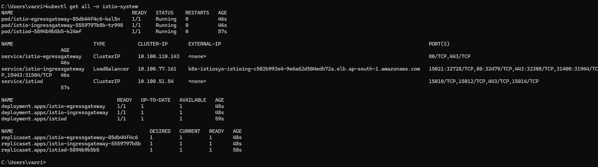
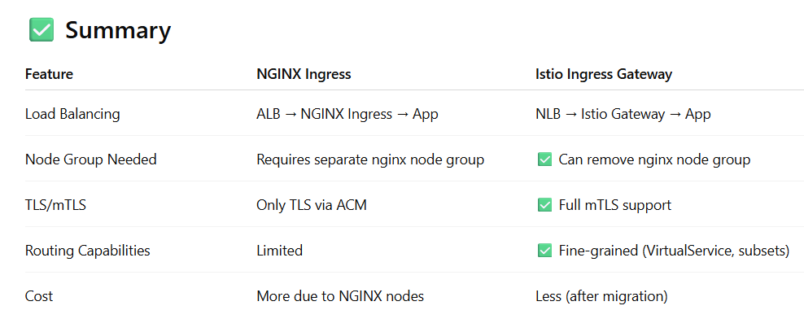
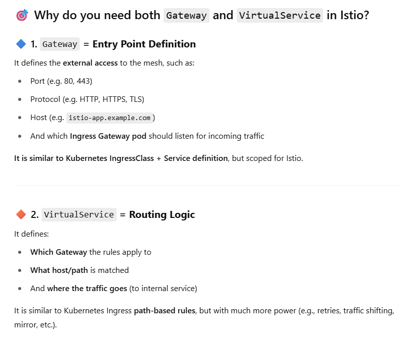
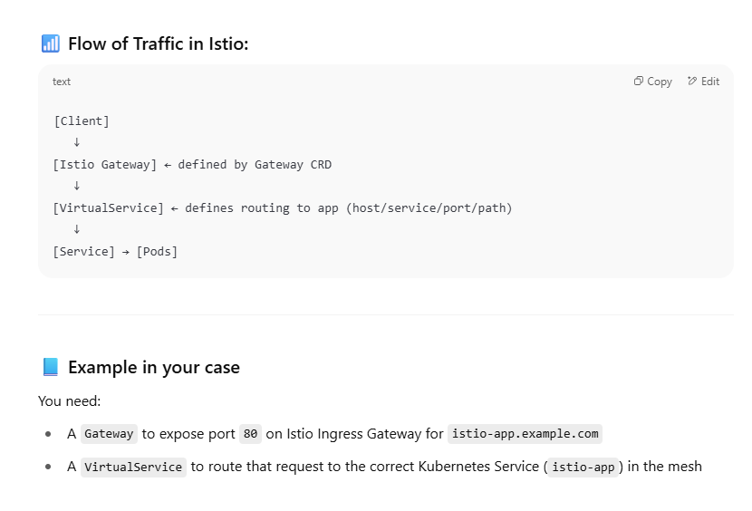
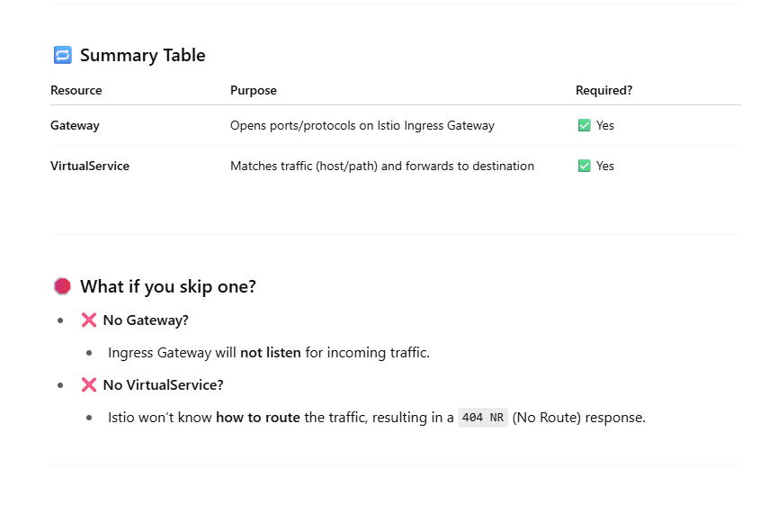
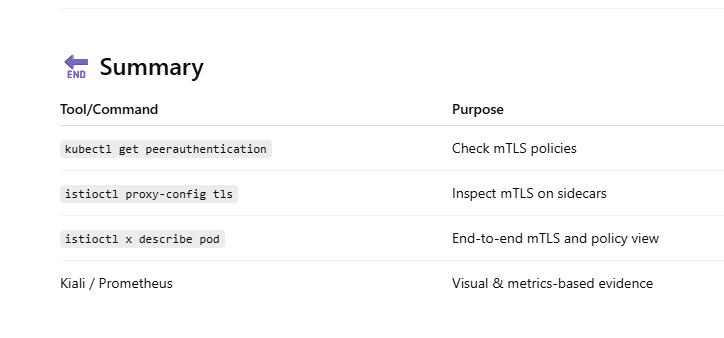

# eks-istio

# create EKS cluster with 3 node groups(core,app,nginx)

### login to aws account
'aws configure'

### create eks-cluster.yaml and run below command to create cluster
'C:\Users\varri>eksctl create cluster -f C:\Users\varri\IdeaProjects\eks-istio\eks-cluster.yaml'

### Connect to eks cluster
aws eks update-kubeconfig --region ap-south-1 --name demo-cluster

### view the status of the nodes
kubectl get nodes

## Deploy App via NGINX Ingress using ALB
### Install AWS Load Balancer Controller (ALB → NGINX)

eksctl utils associate-iam-oidc-provider --region ap-south-1 --cluster demo-cluster --approve

### Create IAM policy
curl -o iam-policy.json https://raw.githubusercontent.com/kubernetes-sigs/aws-load-balancer-controller/main/docs/install/iam_policy.json

aws iam create-policy --policy-name AWSLoadBalancerControllerIAMPolicy --policy-document file://iam-policy.json

 ### Create service account
eksctl create iamserviceaccount --cluster demo-cluster --region ap-south-1 --namespace kube-system --name aws-load-balancer-controller --attach-policy-arn arn:aws:iam::591675357579:policy/AWSLoadBalancerControllerIAMPolicy --approve

### Install using Helm
helm repo add eks https://aws.github.io/eks-charts
helm repo update

helm install aws-load-balancer-controller eks/aws-load-balancer-controller -n kube-system --set clusterName=demo-cluster --set serviceAccount.create=false --set region=ap-south-1 --set vpcId=vpc-0a6262f41dc09bb3d --set serviceAccount.name=aws-load-balancer-controller 

### Install NGINX Ingress Controller
helm repo add ingress-nginx https://kubernetes.github.io/ingress-nginx
helm repo update

helm install nginx-ingress ingress-nginx/ingress-nginx --namespace nginx --create-namespace 

### Deploy a Sample App using NGINX Ingress
kubectl apply -f nginx-app.yaml
kubectl get ingress

## Deploy App with Istio Service Mesh + mTLS
### Install Istio
curl -L https://istio.io/downloadIstio | sh -
cd istio-*/bin
export PATH=$PWD:$PATH
istioctl install --set profile=demo -y

### Annotate the namespace
kubectl label namespace istio-app istio-injection=enabled

### Deploy Sample App with Istio
kubectl apply -f istio-app.yaml

### Enable mTLS
kubectl apply -f peer-authentication.yaml

### Expose via Istio Gateway
kubectl apply -f istio-gateway.yaml

### Get External IP of Istio Gateway
kubectl get svc -n istio-system istio-ingressgateway

Update DNS (e.g., Route53) to point istio-app.example.com to the external IP.

# Delete cluster
eksctl delete cluster --name demo-cluster --region ap-south-1

## delete below resources manually
EC2 Instances → Make sure no leftover worker nodes  

EBS volumes → From Pods with PVCs  

Security Groups → May be left behind by ALB  

Elastic IPs (EIP) → If provisioned, delete them  

VPCs/Subnets → If eksctl created them, they will be auto-deleted with the cluster

